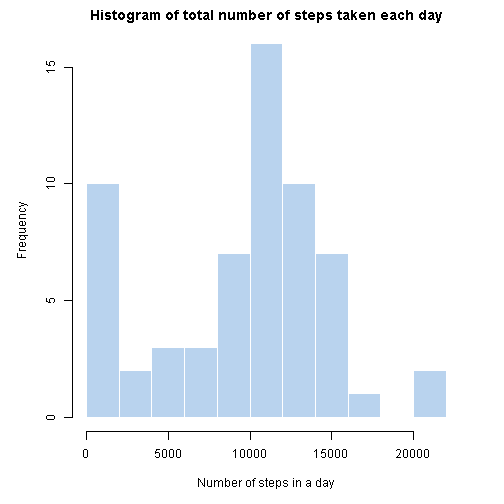

echo=TRUE

# Loading and preprocessing the data

## 1. Read and coerce the date column to character rather than factor from the activity monitoring data ("act") data set 


```r
setwd("E:/R/data/RepData_PeerAssessment1")
library(dplyr)
```

```
## 
## Attaching package: 'dplyr'
## 
## The following object is masked from 'package:stats':
## 
##     filter
## 
## The following objects are masked from 'package:base':
## 
##     intersect, setdiff, setequal, union
```

```r
act <- read.csv("activity.csv", stringsAsFactors = FALSE)
```

## 2. Add hours and minutes

```r
tail(act)
```

```
##       steps       date interval
## 17563    NA 2012-11-30     2330
## 17564    NA 2012-11-30     2335
## 17565    NA 2012-11-30     2340
## 17566    NA 2012-11-30     2345
## 17567    NA 2012-11-30     2350
## 17568    NA 2012-11-30     2355
```

```r
act <- mutate(act, hour = interval %/% 100, minute = interval %% 100)  
```

---

# What is mean total number of steps taken per day?

## 1. histogram of the total number of steps taken each day


```r
ts <- tapply(act$steps, act$date,FUN=sum, na.rm=TRUE)
par(mar=c(5,5,2,3))
hist(ts, breaks= 15, freq=TRUE, border=F, col= "slategray2", main=
"Histogram of total number of steps taken each day", xlab= "Number of steps in a day")
```

 

## 2. the mean and median total number of steps taken per day


```r
#mean
ta <- mean(ts)
print(ta)
```

```
## [1] 9354.23
```

```r
#median
td <- median(ts)
print(td)
```

```
## [1] 10395
```


